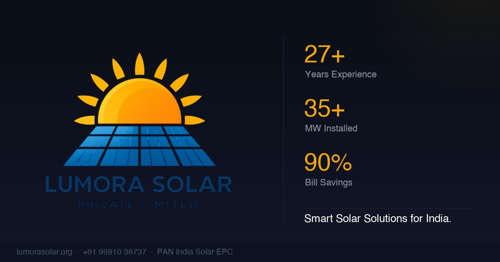

<div align="center">


# Lumora Solar — Official Website

**Production-ready website for Lumora Solar Private Limited**
*PAN India Solar EPC Company · 27+ Years · 35+ MW Installed*




</div>

---

## Overview

A high-performance, visually immersive website for **Lumora Solar Private Limited** — a solar EPC (Engineering, Procurement & Construction) company operating across India. Built entirely with vanilla HTML, CSS, and JavaScript — no frameworks, no build tools — yet delivers an experience on par with React-based production sites.

The site communicates Lumora Solar's core offering: transparent pricing, certified installation, government subsidy guidance, and a track record of 35+ MW across residential, commercial, industrial, and institutional clients.

---

## Features

### 3D Interactive Hero
- Real-time **Three.js** scene with a procedurally generated solar panel mesh and an animated sun with soft sprite-based radial glow
- Particle field with over 100 floating nodes reacting to scroll position
- Smooth camera orbit animation on load

### Cinematic Sections
- **Solar video section** with a full-viewport background video, GSAP parallax overlay, and attention-catching headline typography
- **Silk WebGL backgrounds** — an animated generative silk canvas runs behind Why Go Solar, Solar Systems, Projects, and FAQ sections
- **Preloader** with three conic-gradient orbital arc rings that spin and dissolve into the hero

### Scroll Animations (GSAP + ScrollTrigger)
- Reveal-on-scroll for every card, section header, and content block
- **5-Step Process bar** is scroll-coordinated in real time via a CSS custom property `--lp` driven by `scrub: 0.35` — the progress line fills and steps activate exactly as you scroll
- Counter animation on the hero stats (27+, 35+, 90%)
- Savings comparison bar animates in when it enters the viewport

### Contact Form (Web3Forms)
- Serverless form submission via **Web3Forms** — no backend required, no server costs
- Fields: name, phone, email, installation type (dropdown), monthly bill, message
- On success: confirmation message with the user's name
- On failure: graceful fallback to a **pre-filled WhatsApp message** so the lead is never lost
- Node.js + Express + Nodemailer backend also included in `server.js` for teams that prefer self-hosted email delivery

### Infinite Project Carousel
- 15 real completed projects displayed in a horizontally draggable 3D card grid
- Auto-drifts continuously — drag to jump, release to resume
- Cards show project capacity, location, and scope on hover

### Pricing & Subsidy
- 6 solar system pricing cards (1 kWp → 10 kWp) with accurate India market pricing
- PM Surya Ghar Yojana subsidy table with central + state breakdown
- Highlight card for the best-value tier

### SEO — Production Grade
- Optimised `<title>` and `<meta description>` targeting 13 high-intent India solar keywords
- **Open Graph** + **Twitter Card** meta tags with a custom-generated 1200×630 social preview image
- **JSON-LD structured data** — `Organization`, `LocalBusiness`, `FAQPage`, and `Service` schemas for Google Rich Results
- `robots.txt` and `sitemap.xml`
- `loading="lazy"` on all below-fold images
- All third-party scripts (`Three.js`, `GSAP`) loaded with `defer` to eliminate render-blocking

### Responsive & Accessible
- Fully mobile-responsive from 320px up
- Hamburger navigation with smooth open/close
- `aria-label` on interactive controls
- Semantic HTML5 landmark elements (`<nav>`, `<section>`, `<footer>`, `<main>`)

---

## Tech Stack

| Layer | Technology |
|---|---|
| Structure | HTML5 (semantic) |
| Styling | CSS3 — custom properties, `clamp()`, CSS Grid, Flexbox, `conic-gradient` |
| 3D / WebGL | Three.js r128, custom WebGL silk shader |
| Animations | GSAP 3.12 + ScrollTrigger + ScrollToPlugin |
| Form | Web3Forms (serverless) · Nodemailer fallback |
| Fonts | Google Fonts — Outfit + Inter |
| SEO | JSON-LD, Open Graph, Twitter Cards, sitemap.xml |
| Assets | Pillow (Python) for OG image generation |

---

## Getting Started

### 1. Clone the repo

```bash
git clone https://github.com/YOUR_USERNAME/lumora-website.git
cd lumora-website
```

### 2. Open locally

No build step needed. Open `index.html` directly in a browser, or serve it with any static server:

```bash
# Python (built-in)
python3 -m http.server 3000

# Node.js (npx)
npx serve .
```

### 3. Configure the contact form

The contact form uses **Web3Forms** for serverless email delivery.

1. Go to [web3forms.com](https://web3forms.com) and create a free account
2. Generate an Access Key for your email address
3. In `index.html`, find line ~987 and replace the placeholder:

```html
<input type="hidden" name="access_key" value="YOUR_WEB3FORMS_ACCESS_KEY">
```

That's it — no backend, no server, emails go straight to your inbox.

### 4. (Optional) Self-hosted email via Node.js

If you prefer to run your own mail server:

```bash
npm install
cp .env.example .env
# Fill in your SMTP credentials in .env
node server.js
```

The Express server starts on port 4000 and serves the static site alongside the `/api/contact` endpoint.

---

## Environment Variables

Only needed if using the Node.js backend (`server.js`). Copy `.env.example` to `.env`:

```env
SMTP_HOST=smtp.gmail.com
SMTP_PORT=587
SMTP_SECURE=false
SMTP_USER=your-gmail@gmail.com
SMTP_PASS=xxxx-xxxx-xxxx-xxxx   # Gmail App Password
RECIPIENT_EMAIL=your@email.com
SENDER_NAME=Lumora Solar Website
PORT=4000
```

> **Never commit `.env`** — it's in `.gitignore`.
> For Gmail, use an [App Password](https://support.google.com/accounts/answer/185833) (not your regular password).

---

## Project Structure

```
lumora-website/
├── index.html          # Single-page app — all sections
├── styles.css          # ~2 500 lines — all styling, animations, responsive
├── script.js           # ~700 lines — Three.js, GSAP, form logic, WebGL silk
├── server.js           # Node.js + Express + Nodemailer (optional backend)
├── package.json
├── .env.example        # SMTP config template
├── robots.txt          # Search engine directives
├── sitemap.xml         # XML sitemap for all sections
└── assets/
    ├── logo.png              # Main brand logo
    ├── logo-small.png        # Compact navbar/footer logo
    ├── favicon.png           # Solar sun icon favicon
    ├── favicon-32.png        # 32×32 browser tab icon
    ├── favicon-128.png       # 128×128 / Apple touch icon
    ├── og-image.jpg          # 1200×630 social preview card
    ├── solar-panel-vid.mp4   # Hero background video
    └── project-*.jpg         # 15 completed project photos
```

---

## Sections

| # | Section | Highlights |
|---|---|---|
| 1 | Hero | Three.js 3D scene, particle field, animated counters |
| 2 | Solar Video | Cinematic full-viewport video with GSAP parallax |
| 3 | Why We Started | Company origin story, founder quote |
| 4 | Why Go Solar | 6 benefit cards with lazy-loaded images |
| 5 | Our Services | Residential + Commercial showcase, 5-step included process |
| 6 | Simple 5-Step Process | Scroll-driven animated timeline |
| 7 | Why Choose Lumora | 8 USP cards, savings comparison bar |
| 8 | Solar Systems | On-grid, Off-grid, Hybrid — with facts |
| 9 | PM Surya Ghar Yojana | Subsidy table, pricing grid (1–10 kWp) |
| 10 | Our Past Projects | 15 projects, infinite drag carousel, client marquee |
| 11 | FAQ | 7 questions with JSON-LD markup for Google rich results |
| 12 | Contact | Web3Forms form + 3 office locations |

---

## Deployment

The site is purely static — deploy anywhere:

- **[Netlify](https://netlify.com)** — drag & drop the folder
- **[Vercel](https://vercel.com)** — `vercel` CLI or connect GitHub repo
- **[GitHub Pages](https://pages.github.com)** — push to `gh-pages` branch
- **Any cPanel/shared host** — upload via FTP

After deploying, update the canonical URL and all `og:url` / `sitemap.xml` `<loc>` values from `https://www.lumorasolar.org/` to your live domain.

---

## Credits

Designed and developed by **Sohangi Singh**

- Solar panel 3D model — Three.js procedural geometry
- Project photography — Lumora Solar Private Limited
- Fonts — [Outfit](https://fonts.google.com/specimen/Outfit) + [Inter](https://fonts.google.com/specimen/Inter) via Google Fonts
- Icons — inline SVG (no icon font dependency)

---

<div align="center">

Made with dedication for **Lumora Solar Private Limited**
*Empowering India, one rooftop at a time.*

</div>
